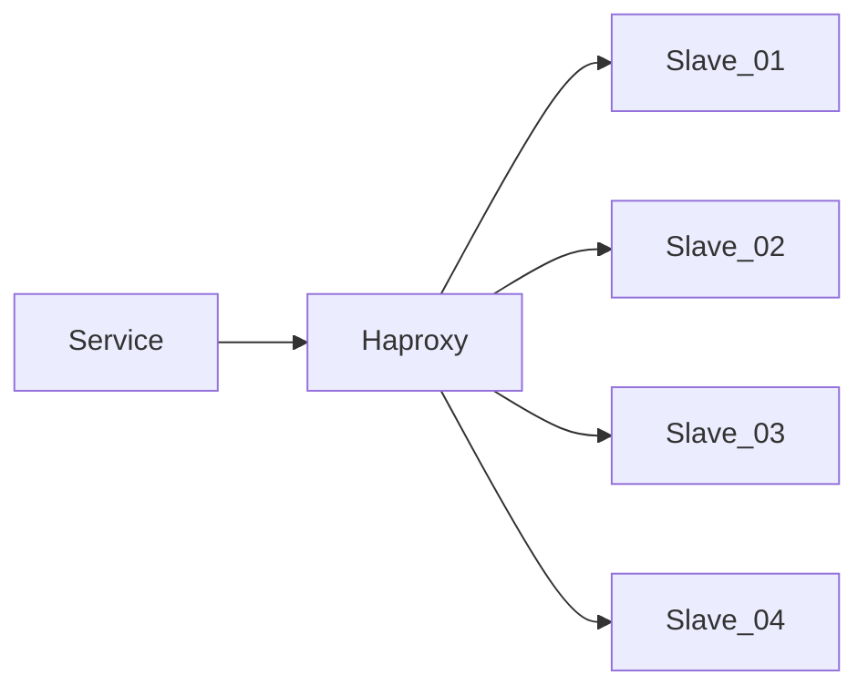

> 在一周内完成并回复简历投递邮件  
> 请尽量作答，难免谬误，敬请指正  
> 如果有任何疑问，欢迎随时来信联系    

一、写一个定时执行的Bash脚本，**每月的一号凌晨1点** 对 MongoDB 中 test.user_logs 表进行备份、清理
  - 首先备份上个月的数据，备份完成后打包成.gz文件
  - 备份文件通过sfpt传输到 **Backup [bak@bak.ipo.com]** 服务器上，账户已经配置在~/.ssh/config;
  - 备份完成后，再对备份过的数据进行清理: **create_on [2024-01-01 03:33:11]** ;
  - 如果脚本执行失败或者异常，则调用 [https://monitor.ipo.com/webhook/mongodb ];
  - 这个表每日数据量大约在 **200w** 条, 单条数据未压缩的存储大小约 **200B**;

  **答案**：
  1. 编写备份脚本 [mongodb_backup.sh](Answers/mongodb_backup.sh)
  2. 将脚本添加到定时任务 cronjob 当中 `0 1 1 * * /scripts/mongodb_backup.sh >> /var/log/mongodb_backup.log 2>&1`

二、根据要求提供一份Nginx配置：
  - 域名：ipo.com, 支持https、HTTP/2
  - 非http请求经过301重定向到https
  - 根据UA进行判断，如果包含关键字 **"Google Bot"**, 反向代理到 server_bot[bot.ipo.com] 去处理
  - /api/{name} 路径的请求通过**unix sock**发送到本地 **php-fpm**，文件映射 **/www/api/{name}.php** 
  - /api/{name} 路径下需要增加限流设置，只允许每秒1.5个请求，超过限制的请求返回 **http code 429**
  - /static/ 目录下是纯静态文件
  - 其它请求指向目录 **/www/ipo/**, 查找顺序 index.html --> public/index.html --> /api/request

  **答案**：
  - nginx 配置文件 [ipo_dot_com_nginx.conf](Answers/ipo_dot_com_nginx.conf)

三、在生产环境中，应用程序是通过Haproxy来读取Slave集群，但是偶尔会产生 **SQLSTATE[HY000]: General error: 2006 MySQL server has gone away** 的错误，请根据经验，给出一排查方案与可能的方向，与开发一起定位问题, 现已经排查：
  - 故障发生时，服务器之间防火墙正常，服务器之间可以正常通信;
  - 故障SQL均可以正常查询，同时不存在性能问题;
  - 故障频率没有发现特别规律，与服务器负载没有正相关;
  - 查看各服务的日志，只发现了错误信息，但没有进一步的说明;

  **答案**：
  - [MySQL 故障排查步骤](Answers/mysql_troubleshooting.md)

四、有一个简单的三层 Web 应用，包含前端（frontend）、中间层（backend），和数据库（database）三部分。这些应用都已经打包成 Docker 镜像，现在需要部署在 Kubernetes 中。
该集群是一个全新部署的集群，除了 kube-proxy, CoreDNS, CNI (Calico) 外没有部署任何应用。请根据下面的要求分别提供部署所需的所有 yaml 定义及部署说明，可以使用 helm 等工具。

具体要求如下：

  1. 前端服务（frontend）：
     - [需要通过外部域名：frontend.example.com访问](Answers/kubernetes-apps/templates/frontend/ingress.yaml)[并支持 https，可以self-signed](Answers/kubernetes-apps/templates/frontend/secrets.yaml)
     - [支持自动扩缩容，根据 CPU (80%) 使用率在 2 到 10 个 Pod 之间调整实例数量](Answers/kubernetes-apps/templates/frontend/hpa.yaml)
     - [该 Pod 需要配置 health check](Answers/kubernetes-apps/templates/frontend/deployment.yaml), [HTTP 协议 9090 端口](Answers/kubernetes-apps/templates/frontend/service.yaml)

  2. 中间层服务（backend）：
     - [仅供前端服务调用，不能对外部暴露](Answers/kubernetes-apps/templates/backend/service.yaml)
     - [支持通过环境变量来配置对 database 的访问，ENV KEY: DB_HOST/DB_NAME/DB_USER/DB_PASS...](Answers/kubernetes-apps/templates/backend/deployment.yaml)
     - [为了保证高可用性，至少要有 3个Pod 同时存活，同时需要 **尽可能** 避免多个 Pod 运行在同一个 Node 上](Answers/kubernetes-apps/templates/backend/deployment.yaml)

  3. 数据库服务（database）：
     - [数据库只允许中间层服务访问，不能通过 ClusterIP 之外的方式暴露](Answers/kubernetes-apps/templates/database/service.yaml)
     - [需要考虑持久化问题，数据存储在 /var/lib/mysql 目录下, 确保 Pod 崩溃或重建后数据不丢失](Answers/kubernetes-apps/templates/database/statefulset.yaml)
  
  **答案**：
  1. 部署配置文件请参照*具体要求*中的链接
  2. 可使用`kubectl apply -f <deployment.yaml>` 依次执行部署文件，secret.yaml 优先
  3. 目录文件已按照helm标准建立，也可使用 helm install <kubernetes-app> 来安装应用
